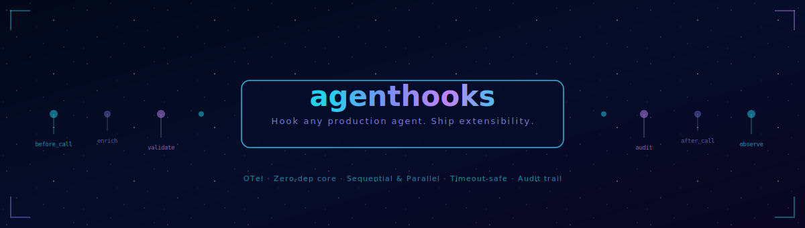

<div align="center">



<br/>
<br/>

[](https://pypi.org/project/agenthooks-py)
[](https://www.python.org)
[](LICENSE)

[](#)
[](https://naveenkumarbaskaran.github.io/agenthooks/)
[](https://pypi.org/project/agenthooks-py)
[](pyproject.toml)

[](https://github.com/langchain-ai/langgraph)
[](https://github.com/crewAIInc/crewAI)
[](https://github.com/microsoft/autogen)
[](https://github.com/openai/openai-agents-python)
[](https://github.com/anthropics/anthropic-sdk-python)

<br/>


<br/>

**Ship agents customers can extend without touching your code.**

*Named hook points · Customer-owned logic · OTel spans + metrics · Timeout-safe · Append-only audit*

```bash
pip install agenthooks-py
```

</div>

---

## The Problem

You build a production AI agent. A customer deploys it. They need:

- Inject their own context before every LLM call
- Enforce their approval workflows before write operations
- Log to their own audit system
- Apply their own rate limits and compliance rules
- Block certain operations based on their internal policies

**Today:** They fork the agent, modify source code, and you lose control of the release cycle.

**With agenthooks:** You declare named hook points inside your agent. Customers register their logic against those points. No fork. No PR. Nothing breaks if their hook fails.

---

## Install

```bash
pip install agenthooks-py                    # zero-dependency core
pip install agenthooks-py[pydantic]          # + type-validated contexts
pip install agenthooks-py[otel]              # + OpenTelemetry API (spans + metrics)
pip install agenthooks-py[all]               # everything
```

---

## 30-second demo

```python
from agenthooks import HookAgent, hookpoint, HookRegistry, HookContext

# Agent author declares hook points — once, in their agent code.
class SearchAgent(HookAgent):
    before_search = hookpoint("before_search")

    async def search(self, query: str) -> dict:
        ctx = HookContext.new(session_id="s1", tenant_id="acme", query=query)
        async with self.before_search.run(ctx) as ctx:
            return {"query": ctx.query, "filters": ctx.metadata.get("filters", {})}

# Customer registers their own logic — zero source changes to the agent.
registry = HookRegistry()

@registry.implement("before_search")
async def inject_region_filter(ctx: HookContext) -> HookContext:
    return ctx.enrich("filters", {"region": "EU", "language": "en"})

# At deploy time, customer attaches their registry.
agent = SearchAgent(registries=[registry])
result = await agent.search("quarterly report")
# {'query': 'quarterly report', 'filters': {'region': 'EU', 'language': 'en'}}
```

---

## Customer Freedom

Every deployment is different. agenthooks lets customers hook their logic at any point in the agent pipeline — without a fork:

```python
# Customer A: approval gate
@acme_registry.implement("before_execute", filter={"tenant": "ACME"})
@block_if(lambda ctx: ctx.tool_name == "delete_all", reason="Requires VP approval")
@inject(approved_by="manager@acme.com")
async def acme_approval(ctx): return ctx

# Customer B: compliance enrichment
@globex_registry.implement("before_execute", filter={"tenant": "GLOBEX"})
@inject(compliance_tier="SOC2", data_residency="US")
async def globex_compliance(ctx): return ctx

# Customer C: rate limiting
@initech_registry.implement("before_execute", filter={"tenant": "INITECH"})
@rate_limit(per="tenant", limit=500, window_s=60)
async def initech_rate_limit(ctx): return ctx

# One agent binary. Three independent customer extensions. No source changes.
agent = MyAgent(registries=[acme_registry, globex_registry, initech_registry])
```

Each customer's hooks only fire for their tenant. They can't see or affect each other's logic.

---

## Production Reliability

Customer hook code cannot crash the agent. Every hook runs under a timeout. Failures degrade gracefully.

```python
@registry.implement("before_call",
    timeout_ms=200,   # hard timeout — hook gets 200ms
    fallback=True,    # on timeout/error: degrade silently, continue
    order=10,         # execution order across multiple hooks
)
async def external_enrichment(ctx): ...
# If this times out → agent continues with whatever context was built before it.
# If this throws → agent continues. Error is recorded in audit trail + OTel span.
```

---

## OpenTelemetry — Production Observability

Every hook execution is automatically traced and metered. No instrumentation code required.

```python
# Wire up the OTel SDK once at startup (pip install agenthooks[otel])
from opentelemetry import trace
from opentelemetry.sdk.trace import TracerProvider
from opentelemetry.sdk.trace.export import BatchSpanProcessor
from opentelemetry.exporter.otlp.proto.grpc.trace_exporter import OTLPSpanExporter

provider = TracerProvider()
provider.add_span_processor(BatchSpanProcessor(OTLPSpanExporter()))
trace.set_tracer_provider(provider)

# Every hook now appears as a child span in Jaeger / Tempo / Datadog APM.
# No changes to agent code or hook code required.
```

**Spans emitted per hook execution:**

| Attribute | Value |
|---|---|
| `hook.name` | hookpoint name (`before_call`) |
| `hook.impl` | implementation function name |
| `hook.tenant_id` | tenant from context |
| `hook.status` | `ok` \| `timeout` \| `error` \| `blocked` \| `skip` |
| `hook.duration_ms` | wall-clock latency |

**Metrics emitted automatically:**

| Metric | Type | Dimensions |
|---|---|---|
| `agenthooks.hook.executions` | Counter | `hook.name`, `hook.impl`, `hook.status` |
| `agenthooks.hook.duration_ms` | Histogram | `hook.name`, `hook.impl` |
| `agenthooks.hook.errors` | Counter | `hook.name`, `hook.impl` |
| `agenthooks.hook.timeouts` | Counter | `hook.name` |
| `agenthooks.hook.blocked` | Counter | `hook.name`, `hook.impl` |

When the OTel SDK is not installed, a zero-allocation in-process fallback is used. Metrics are still readable in tests.

---

## Audit Trail

Every hook execution is written to an append-only JSONL audit log. This cannot be disabled — it is a security invariant.

```jsonl
{"ts": 1750000000.0, "hook.name": "before_call", "hook.impl": "acme_approval", "hook.status": "ok", "hook.duration_ms": 12.3, "hook.tenant_id": "ACME", "trace_id": "abc123", "session_id": "sess-1"}
{"ts": 1750000001.0, "hook.name": "before_execute", "hook.impl": "blocker", "hook.status": "blocked", "hook.error": "Requires VP approval", "hook.tenant_id": "ACME", "trace_id": "abc124"}
```

```python
from agenthooks import AuditTrail, set_default_audit

# Custom path (default: ~/.agenthooks/audit.jsonl)
set_default_audit(AuditTrail(path="/var/log/myagent/hooks.jsonl"))
```

---

## Pattern Decorators

Zero-boilerplate hooks for the most common enterprise patterns:

```python
from agenthooks import inject, block_if, redact, rate_limit, require_tenant, retry

# Inject static or dynamic context
@inject(plant="1000", fiscal_year=lambda ctx: erp.get_fy(ctx.tenant_id))
async def my_hook(ctx): return ctx

# Block based on a condition
@block_if(lambda ctx: not authz.allowed(ctx.tenant_id), reason="Not authorised")
async def my_hook(ctx): return ctx

# Redact sensitive fields in audit logs
@redact("api_key", "bearer_token", "password")
async def my_hook(ctx): return ctx

# Rate limit by tenant or session
@rate_limit(per="tenant", limit=1000, window_s=60, on_exceeded="block")
async def my_hook(ctx): return ctx

# Allow-list tenants
@require_tenant("ACME", "GLOBEX")
async def my_hook(ctx): return ctx

# Retry on transient failures
@retry(max_attempts=3, backoff_ms=100)
async def my_hook(ctx): return await external_service.enrich(ctx)

# Compose freely — decorators stack bottom-up
@inject(env="production")
@block_if(lambda ctx: not ctx.tenant_id, reason="No tenant")
@redact("api_key")
@rate_limit(per="tenant", limit=500, window_s=60)
async def full_pipeline_hook(ctx): return ctx
```

---

## How It Works

```
Agent declares hook points          Customer registers implementations
─────────────────────────           ─────────────────────────────────
class MyAgent(HookAgent):           @registry.implement("before_call",
    before_call = hookpoint(            filter={"tenant": "ACME"},
        "before_call",                  order=10,
        mode="multi",                   timeout_ms=200,
    )                                   fallback=True)
                                    async def my_impl(ctx): ...

At runtime, for each hook point:

  1. Collect all registered impls matching the current context filters
  2. Sort by order
  3. Execute sequentially (or in parallel if parallel=True)
     └─ Each impl runs under its timeout_ms budget
     └─ Timeout → degrade (log + metric + audit), continue
     └─ Error → degrade (log + metric + audit), continue
     └─ HookBlocked → propagate to agent (controlled stop)
     └─ HookSkip → short-circuit remaining impls
  4. OTel span + metric recorded for every execution
  5. Audit trail entry written (always)
  6. Yield enriched context to agent body
```

---

## Repo Structure

```
agenthooks/
├── src/agenthooks/
│   ├── __init__.py              ← all public exports
│   ├── core/
│   │   ├── context.py           ← HookContext (immutable, sealed fields)
│   │   ├── registry.py          ← HookRegistry + @implement decorator
│   │   ├── hookpoint.py         ← hookpoint() descriptor + executor
│   │   ├── exceptions.py        ← HookBlocked, HookSkip, HookTimeout, ...
│   │   └── contract.py          ← semver range contract validation
│   ├── executor/
│   │   ├── sequential.py        ← SequentialExecutor
│   │   └── parallel.py          ← ParallelExecutor
│   ├── agent/
│   │   ├── base.py              ← HookAgent base class
│   │   └── wrapper.py           ← HookWrapper (wraps any callable)
│   ├── store/
│   │   └── memory.py            ← InMemoryStore
│   ├── security/
│   │   └── guards.py            ← injection_scan()
│   ├── observability.py         ← OTel spans, metrics, structured logging
│   ├── audit.py                 ← AuditTrail (append-only JSONL)
│   └── patterns.py              ← inject, block_if, redact, rate_limit, ...
├── tests/                       ← 91 tests
├── examples/
│   ├── 01_basic_hooks.py
│   ├── 02_customer_extensibility.py
│   ├── 03_multi_tenant_isolation.py
│   ├── 04_resilience.py
│   └── 05_opentelemetry.py
└── docs/                        ← architecture, security, flow docs
```

---

## Security

- **Sealed fields** — `session_id`, `tenant_id`, `trace_id`, `span_id`, `turn`, `timestamp` are read-only for hook implementations. Any attempt to write them raises `HookSecurityError`.
- **Injection scanning** — `injection_scan()` detects prompt injection patterns in hook-modified queries before they reach the LLM.
- **Redaction** — `ctx.redact("field")` marks fields so audit logs and OTel exporters surface them as `[REDACTED]`.
- **Tenant isolation** — filter conditions are evaluated by the executor, not by hook code. A hook cannot see or affect another tenant's execution.
- **Audit invariant** — the audit trail cannot be disabled. Every hook execution (including failures) is recorded.

---

## Development Setup

```bash
git clone https://github.com/naveenkumarbaskaran/agenthooks
cd agenthooks
python -m venv .venv && source .venv/bin/activate
pip install -e ".[dev]"
pytest tests/         # 91 passed
```

---

## Roadmap

- `SqliteStore` — durable registry across restarts
- `HttpRegistry` — remote hook implementations over HTTP
- `StreamingContext` — delta streaming through hook pipeline
- OTel SDK integration tests with real Jaeger
- CLI: `agenthooks audit` — verify audit trail integrity
- Circuit breaker per hook impl

---

<div align="center">

**Apache 2.0 License** · [Docs](https://naveenkumarbaskaran.github.io/agenthooks/) · [Issues](https://github.com/naveenkumarbaskaran/agenthooks/issues)

*Built by [Naveen Kumar Baskaran](https://github.com/naveenkumarbaskaran)*

</div>
